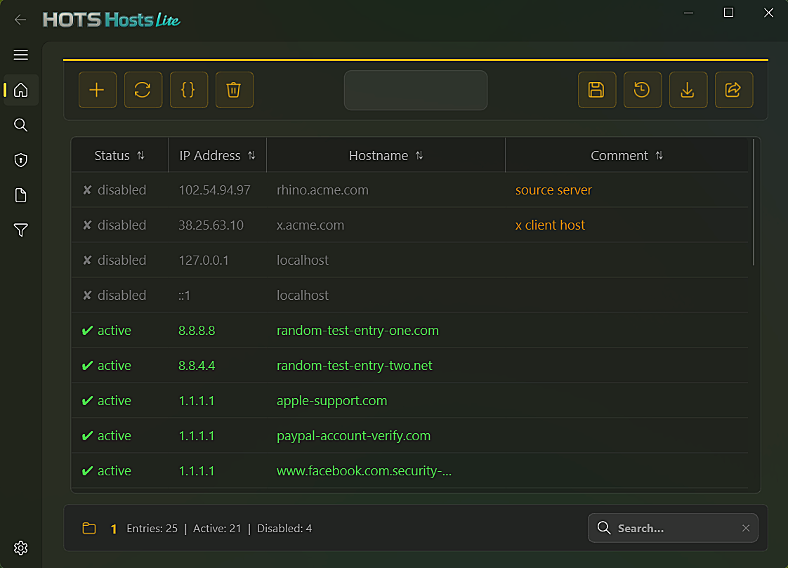
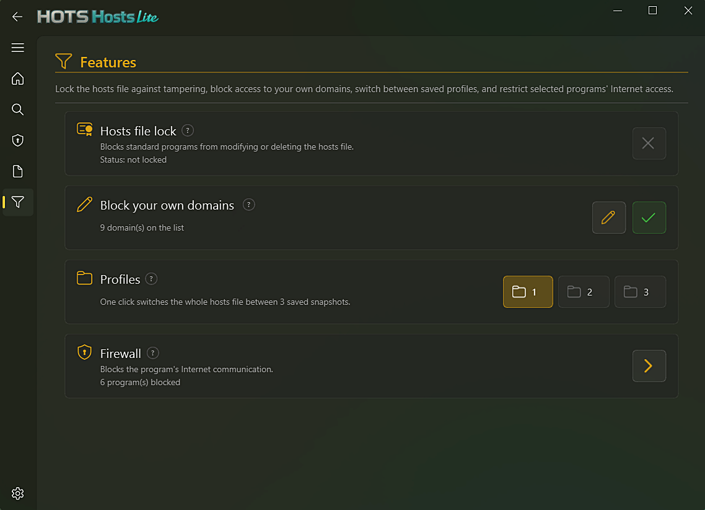
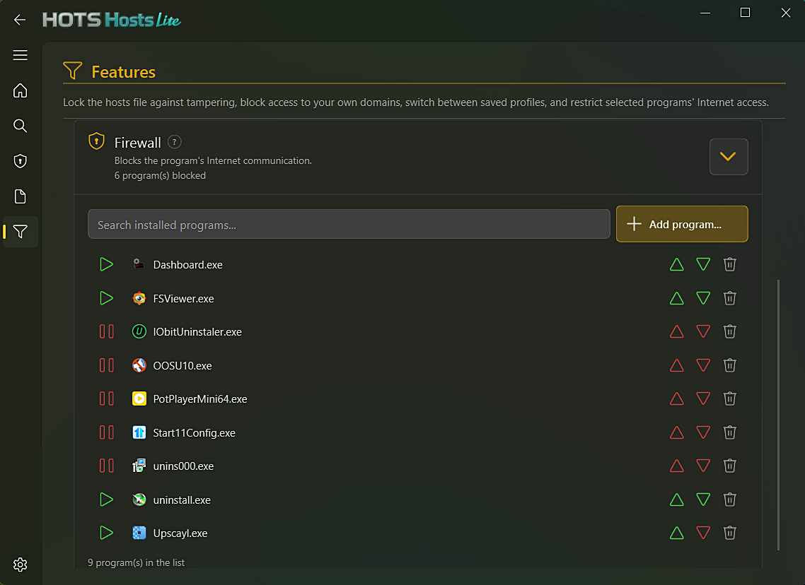
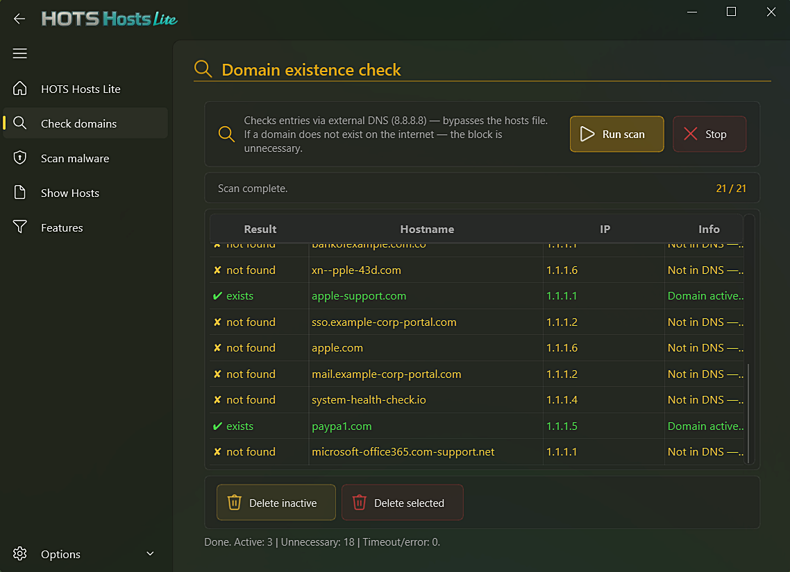
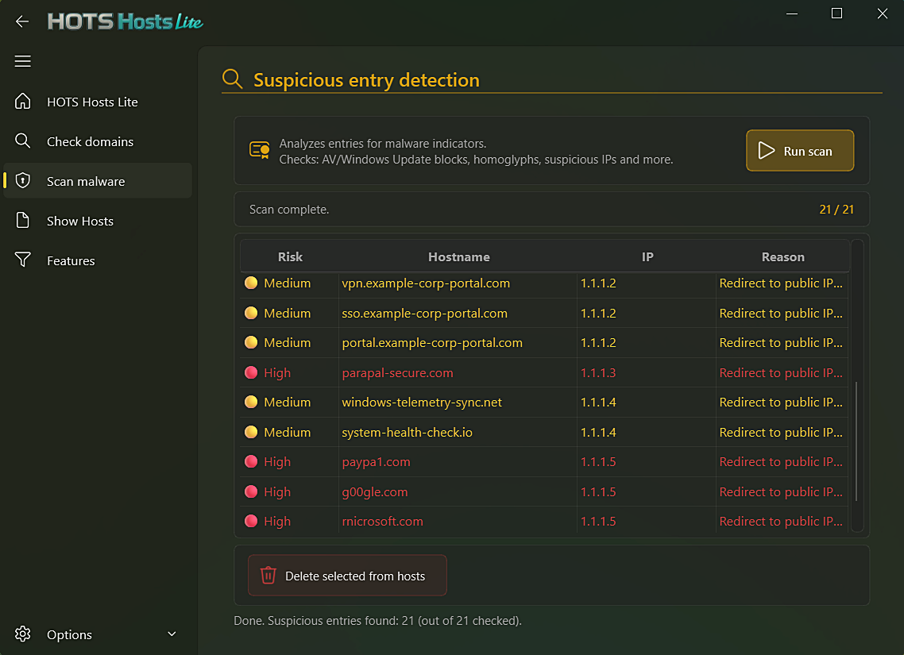
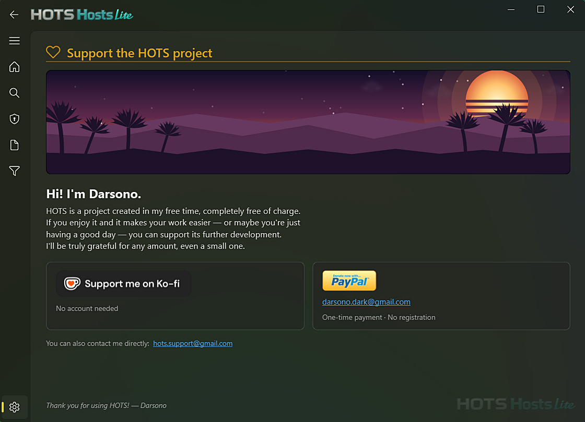

<div align="center">


# HOTS Hosts Lite

**Block distracting apps and websites, lock down your hosts file, and edit it properly — free, lightweight, no bloat.**

[](https://www.gnu.org/licenses/gpl-3.0)
[](https://github.com/)
[](#language-support)

### 📥 [⬇️ Download for Windows — free](https://github.com/darsono6/HOTS-Hosts-Lite/releases/latest/download/HOTS_Hosts_Lite_setup.exe)

*No account, no subscription, no ads. Just download and run.*

</div>

---

## What does it actually do?

Three things, in plain terms:

- 🚫 **Block domains & apps** — keep a simple list of your own domains to block, and stop specific programs from reaching the network with the built-in firewall.
- 🔒 **Lock the hosts file** — one click protects it from being edited by other programs (or a curious kid) outside the app.
- ✏️ **Hosts file editor** — a proper table editor instead of fighting Notepad and admin permissions, with 3 switchable profiles so you can keep separate setups and flip between them.

You don't need to understand *how* any of this works to use it — the app walks you through it.

<div align="center">



</div>

---

## Getting started

1. **[Download the installer](https://github.com/darsono6/HOTS-Hosts-Lite/releases/latest/download/HOTS_Hosts_Lite_setup.exe)**
2. Double-click it — Windows will ask for Administrator permission (that's normal, the app needs it to edit system files)
3. Follow the setup wizard — done

**Requires:** Windows 10 or 11, 64-bit.

### About the Windows warning you might see

Since this is a small independent project without a paid certificate, Windows may show a **"Windows protected your PC"** warning the first time you run it. This is normal for any new app that hasn't built up a download history yet — it does **not** mean anything is wrong with the file.

To continue: click **More info** → **Run anyway**.

If you'd rather double-check the app yourself first, the full source code is right here in this repository — see [Running from source](#running-from-source) below.

---

## Everything it can do

<details>
<summary><strong>🚫 Domain & App Blocking</strong> — click to expand</summary>

- **Block your own domains** — a free-text list, applied directly to the hosts file
- **Hosts file lock** — ACL deny-write protection so your blocklist can't be edited or removed from outside the app
- **Application firewall blocking** — stop specific programs from reaching the network, outbound and inbound independently
- **3 switchable profiles** — keep separate block configurations and swap between them instantly

<div align="center">

</div>

</details>

<details>
<summary><strong>✏️ Hosts File Editor</strong> — click to expand</summary>

- Table view of all entries, live search, bulk paste, sorting
- Add / edit / delete / enable-disable entries without touching Notepad
- Auto-backup before every save — rotating archive (15 kept on the default profile, 10 each on profiles 2 and 3), with a diff preview before writing
- Import/export `.txt` or `.csv`
- Domain checker — flags entries pointing at domains that no longer exist
- Malware scanner — heuristics for hijacked/suspicious entries (homoglyphs, zero-width characters, punycode, typosquatting, DGA-style entropy, and more)
- Raw text view for anyone who wants to edit the file directly

<div align="center">



</div>

</details>

<details>
<summary><strong>🎨 Other features</strong> — click to expand</summary>

- Light and dark themes, 4 accent colors
- 7 languages: English, Polski, Français, Deutsch, Español, Português, Русский
- Optional password protection
- Built-in update checker
- Auto-elevation, single-instance guard, window geometry memory

</details>

---

**Need more?** The full **[HOTS Hosts](https://github.com/darsono6/HOTS)** adds Cloudflare Family DNS, DNS-over-HTTPS blocking, VPN client blocking, System Restore protection, and a full tiered Windows privacy module.

---

## Running from source

<details>
<summary>For developers — click to expand</summary>

**Requirements:** Python 3.10+, `PySide6`, `PySide6-Fluent-Widgets`

```bash
pip install PySide6 "PySide6-Fluent-Widgets[full]"
```

```bash
git clone https://github.com/darsono6/HOTS-Hosts-Lite.git
cd HOTS-Hosts-Lite
pythonw hosts_editor_launcher.pyw
```

> Run the launcher, not `python -m hosts_editor` directly — `hosts_editor_launcher.pyw` is what handles the single-instance guard and requests Administrator rights via UAC. The hosts file is write-protected by Windows, so the app won't work correctly without that elevation step.

### Project structure

```
hosts_editor_launcher.pyw   # Single-instance guard + admin elevation entry point (build target)
hosts_editor/
├── __main__.py             # Entry point — app startup, password prompt, language init
├── app.py                  # Main window (Fluent navigation shell)
├── core.py                 # Data logic — parse, save, import/export, profiles, custom domain blocking
├── core_hosts_lock.py       # Hosts file lock (ACL deny-write protection)
├── core_firewall.py        # Application firewall blocking (netsh rules)
├── core_profiles.py        # 3-slot hosts profile switching
├── core_installed_apps.py  # Installed-app lookup (registry) for the firewall block picker
├── bg_tasks.py              # Background worker thread registry — joined on app quit
├── constants.py            # Theme colors, accent presets, paths, settings load/save
├── widgets_qt.py            # Reusable Qt/Fluent UI components — buttons, dialogs, pages
├── resource_utils.py       # Base-path resolution (dev / frozen / Nuitka builds)
├── i18n.py                  # Multilingual string system (EN / PL / FR / DE / ES / PT / RU)
├── graphic/
│   ├── logo.png             # About page logo
│   ├── logo.ico              # Window/taskbar icon
│   ├── logo1.png             # Splash screen shown while the app starts
│   ├── logoS.png             # Small logo — title bar + Support page watermark
│   ├── support_me_on_kofi_dark.png   # Ko-fi donate button on the Support page
│   └── paypal_donate_button.png      # PayPal donate button on the Support page
└── dialogs/
    ├── entry_dialog.py          # Add / Edit entry form
    ├── diff_dialog.py            # Diff preview before save
    ├── backup_page.py            # Backup Manager
    ├── diagnostics_page.py       # Domain check & malware scan
    ├── features_page.py          # Domain blocking + hosts lock + firewall + profiles panel
    ├── custom_domains_dialog.py  # Editor for the "Block your own domains" list
    ├── export_dialog.py          # Export to .txt / .csv
    ├── language_dialog.py        # Language selection
    ├── accent_dialog.py          # Accent color picker
    ├── support_page.py           # Support / donate window
    ├── about_page.py             # About & update checker
    ├── password_dialog.py        # Set / verify startup password
    └── _*.py                     # Shared/internal helpers for the pages above
```

</details>

---

## Language support

The interface language can be changed in **Options → Language**. All UI strings, dialogs, and system comments are fully translated.

| Code | Language |
|------|----------|
| `en` | English (default) |
| `pl` | Polski |
| `fr` | Français |
| `de` | Deutsch |
| `es` | Español |
| `pt` | Português |
| `ru` | Русский |

---

## Disclaimer

HOTS Hosts Lite is provided in good faith but **without any warranty**. The author is **not responsible** for any damage, data loss, system issues, or other consequences resulting from the use of this application. Modifying the hosts file affects system-level network resolution — use with care. You use this software **at your own risk**.

---

## Support

If HOTS Hosts Lite saves you time or you simply want to say thanks:

<a href="https://ko-fi.com/darsono"></a>

**Website:** [hotstools.com](https://hotstools.com)
**Ko-fi:** [ko-fi.com/darsono](https://ko-fi.com/darsono)
**PayPal:** [paypal.me/darsonodark](https://paypal.me/darsonodark)
**Support:** hots.support@gmail.com

No registration required. Any amount is appreciated.

<div align="center">

</div>

---

## License

[GNU General Public License v3.0](LICENSE.txt)
© 2026 Darsono
